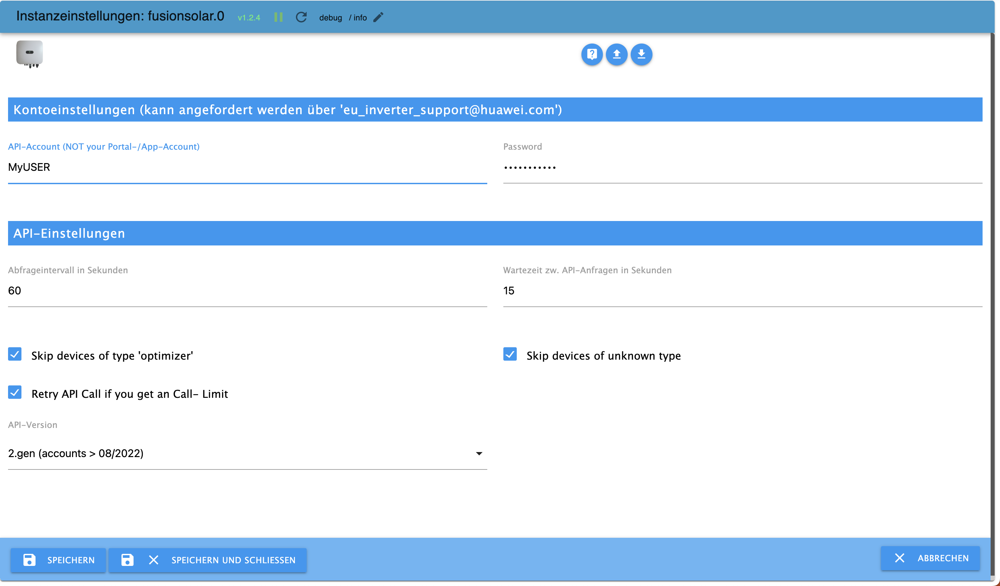
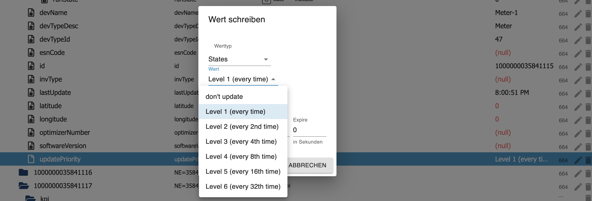

# ioBroker.FusionSolar

## fusion solar adapter for ioBroker

Adapter to connect to the Huawei 'Fusion Solar' cloud

Build State: [/_apis/build/status/ioBroker.FusionSolar)](https://tobiaskorn.visualstudio.com/KornSW%20(OpenSource)/_build/latest?definitionId=44)

Discussion: [Thread in ioBroker Forum](https://forum.iobroker.net/topic/59422/new-adapter-huawei-fusionsolar-api)

NPM-Package: [here](https://www.npmjs.com/package/iobroker.fusionsolar)

## Contributors wanted!

I started this project because I needed it myself. In order to be able to offer a solution that is as complete as possible, I am happy about everyone who would like to help here! Please feel free to contact me...

## Help (installation)

  1. go to your ioBroker admin frontend

  2. (if not done yet) enable expert mode in (in the ioBroker settings)

       here you'll find:

  3. go to the 'Adapters' page

  4. click on the GitHub-icon in the toolbar -> a dialog opens...

  5. switch to the tab on the center to select a GitHub source repository ans select "**undefined [KornSW]**"

>I dont know why currently the name is not displayed properly, but im sure that i can fix it in the near future....

  6. press the 'install' button below to let ioBroker download and register it

  7. now the fusionsolar adapter should be in the collection -> select it

  8. click on the '...' icon and on the '+' icon to create an instance

  9. enter the credentials of your fusionsolar **API**-Account (**NOT** your Portal-/App-Account!)

        (if you don't have one, you can request one from: 'eu_inverter_support@huawei.com')

        

  10. have fun!

## API-Versions

Within the config dialog you can enable the support for the breaking changes that were suddenly made to the API.

## Call Limits & Settings

We added two new functions regarding API Limitations and #407 API Errors. 

* Main Setting - **Retry API call: if there is a call limit (#407)**
* Device Objects - **Loading frequency per device**

The **Retry API call: if there is a call limit (#407)** function will not skip the calls anymore, if the API will give an Call Limit issue back. We try with this function to load the data, until we are getting *success* (Before we skipped that call).

Every Device has now a **Loading frequency per device** state where you can set the Loading frequency. 

##### Example

In you Adapter Setting you have *60* Seconds in your **Abfrageintervall in Sekunden** and *15* in your **Wartezeit zwischen API-Anfragen in Sekunden**. 
This means, the Adapter will initiate the requests from Huawai every **60** seconds and will make a break after every API call for **15** Seconds. 

Usually we loaded all devices here.

You can set now in every device a Level with the following settings:

|ID|Level|Info|Explaination|
|--|--|--|--|
|0|don't update||After init call, it will never update this device again|
|1|Level 1|every time|Calls this device every 60 sec. *|
|2|Level 2|every 2nd time|Calls this device every 120 sec. *|
|3|Level 3|every 4th time|Calls this device every 240 sec. *|
|4|Level 4|every 8th time|Calls this device every 480 sec. *|
|5|Level 5|every 16th time|Calls this device every 960 sec. *|
|6|Level 6|every 32thtime|Calls this device every 1920 sec. *|
 
 \* after a finished complete loop. 
 
## @Huawei

Unfortunately i have to say that the api feels relatively unstable. Above all, dealing with the numerous quota restrictions and different error endings can only be managed by senior developers. I hope that this is not an experiment, and that you will continue to further develop the api. Otherwise my work was unfortunately in vain. There is a large community with the need of a working api.
It would also be nice, if you could check why the returned values sometimes deviate from those in your app (sometimes so much that it cannot be a matter of a time lag).

## Changelog

### 1.2.4
* (Stolly82) API Call Limit Optimization",
### 1.2.3
* (KornSW) support for new API-version",
### 1.1.0
* (KornSW) Opt-in for loading data of 'optimizers' or unknown devices (to reduce api load)",
### 1.0.1
* (KornSW) Wait time betw. API calls can now be configured (should help on quota problems)
### 1.0.0
* (KornSW) MVP level reached after some fixes regarding automatic async retries
### 0.3.0
* (KornSW) added device related channels (now MVP candidate)
### 0.2.0
* (KornSW) login and inverter realtime KPI now working
### 0.1.0
* (KornSW) initial version (inspired by https://github.com/Newan/ioBroker.easee - thnx to Newan!)

## License

MIT License

Copyright (c) 2022 KornSW

Permission is hereby granted, free of charge, to any person obtaining a copy
of this software and associated documentation files (the "Software"), to deal
in the Software without restriction, including without limitation the rights
to use, copy, modify, merge, publish, distribute, sublicense, and/or sell
copies of the Software, and to permit persons to whom the Software is
furnished to do so, subject to the following conditions:

The above copyright notice and this permission notice shall be included in all
copies or substantial portions of the Software.

THE SOFTWARE IS PROVIDED "AS IS", WITHOUT WARRANTY OF ANY KIND, EXPRESS OR
IMPLIED, INCLUDING BUT NOT LIMITED TO THE WARRANTIES OF MERCHANTABILITY,
FITNESS FOR A PARTICULAR PURPOSE AND NONINFRINGEMENT. IN NO EVENT SHALL THE
AUTHORS OR COPYRIGHT HOLDERS BE LIABLE FOR ANY CLAIM, DAMAGES OR OTHER
LIABILITY, WHETHER IN AN ACTION OF CONTRACT, TORT OR OTHERWISE, ARISING FROM,
OUT OF OR IN CONNECTION WITH THE SOFTWARE OR THE USE OR OTHER DEALINGS IN THE
SOFTWARE.